# :book: 2. Create a new Ubuntu 22.04 Virtual Machine in VirtualBox
By [Antonio Salazar](mailto:antonio.salazar@ymail.com) - September 2022

**Document log**
|Date|Description|
|:--:|--|
|2022-09|Inicial creation. Steps with screen-shots only.|
|2023-01| Added sections: Document log, Work Sumary, Requisites, and References|

# Work summary
- Set up a new Virtual Machine with Ubuntu 22.04 Server Installed.

# Requisites
- Install [Oracle VM VirtualBox Manager](https://www.virtualbox.org/manual/UserManual.html#intro-installing) on your laptop, personal computer, or workstation.

# :paw_prints: Steps

1. Download the Ubuntu 22.04 Server ISO image from the [Ubuntu 22.04 Releases](https://releases.ubuntu.com/22.04/) page.
2. Open Oracle VM VirtualBox manager.
3. Select the **New** *(Ctrl+N) Machine* menu option.
    
    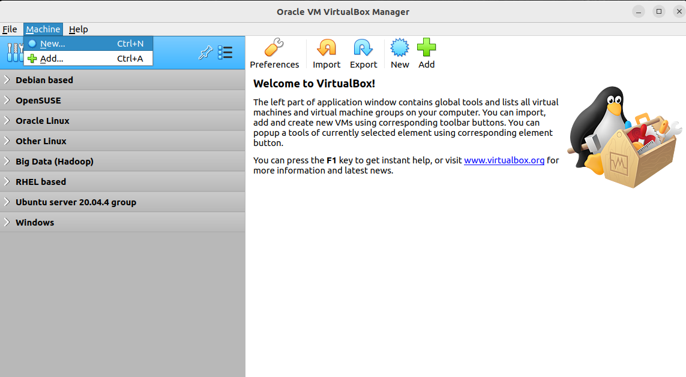
    
4. Set the Virtual Machine Name, Files Location, OS Type and Version.
    
    
    
5. **Hard Disk**: Create a virtual hard disk now.
    
    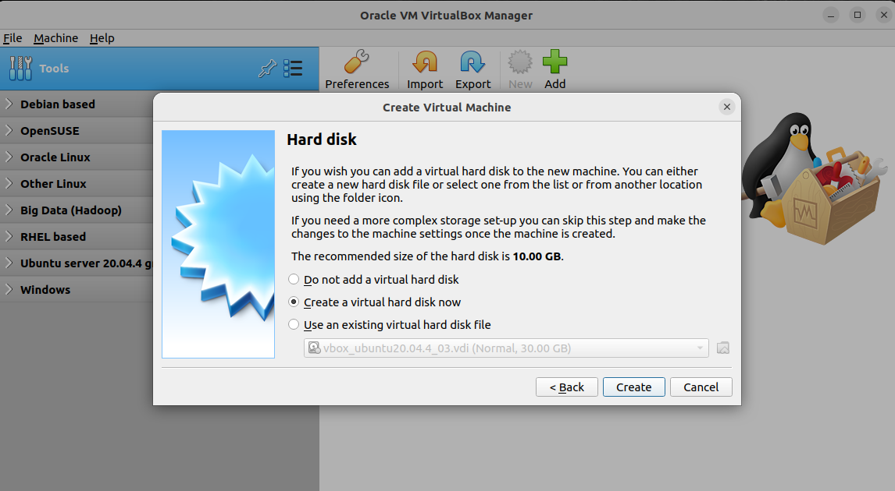
    
6. **Hard disk file type**: VDI (VirtualBox Disk Image)
    
    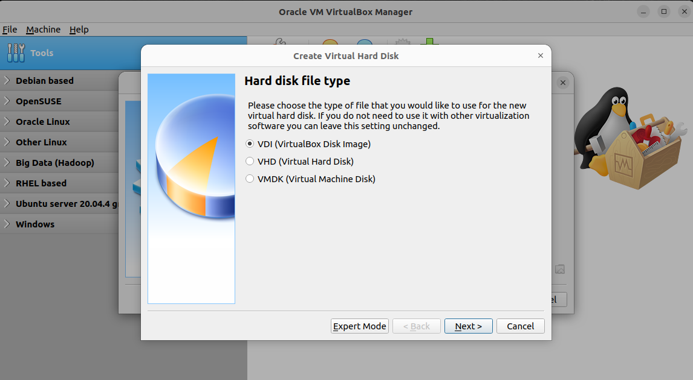
    
7. **Storage on physical hard disk**: Dynamically allocated.
    
    
    
8. **File location and size**: location of your best choice, recommended size 20 GB at least.
    
    
    
9. Click on **Properties**.
    
    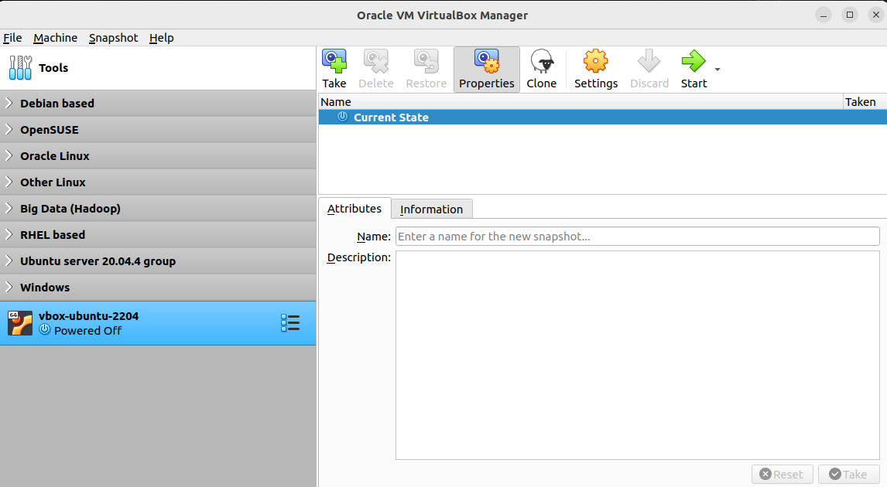
    
10. Go to **Storage, Optical Drive** and pick the **ubuntu-20.04.4-live-server-amd64.iso** file.
    
    
    
11. Go to **Network** and set the parameter below:
    1. **Enable Network Adapter**: check. 
    2. **Attached to**: Bridged Adapter.
    3. **Name**: Your available network device name.
    4. **Advanced**: expand.
    5. **Cable connected**: check.
    
    
    
12. Click on **Start.**

    
    
13. Select your preferred language for the installation process.
    
    
    
14. Choose **Install Ubuntu Server**.
    
    
    
15. Select the preferred language one more time.
    
    
    
16. **Continue without updating**.
    
    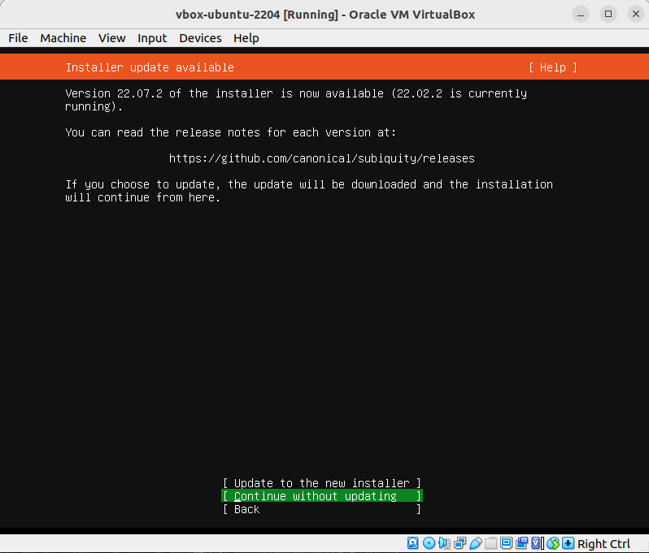
    
17. **Done**: once the keyboard layout satisfied your needs.
    
    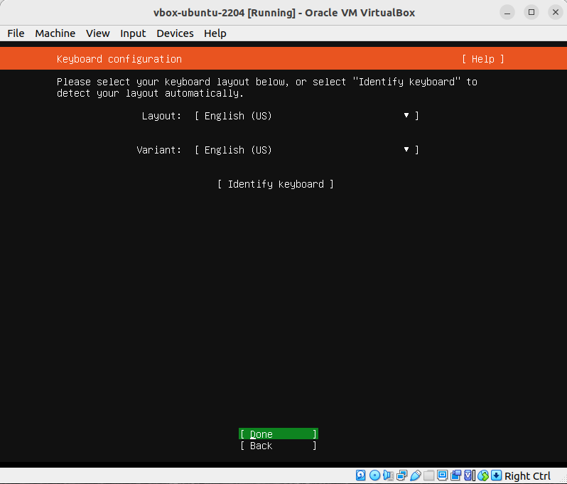
    
18. **Done**: leave the DHCP and default network device as is.
    
    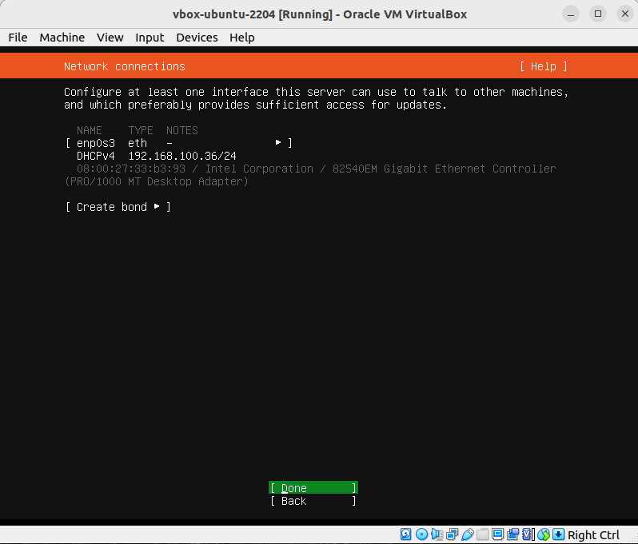
    
19. **Done**: leave proxy access defaults.
    
    
    
20. **Done**: leave Mirror address defaults.
    
    
    
21. **Done**: Leave default partitions defaults.
    
    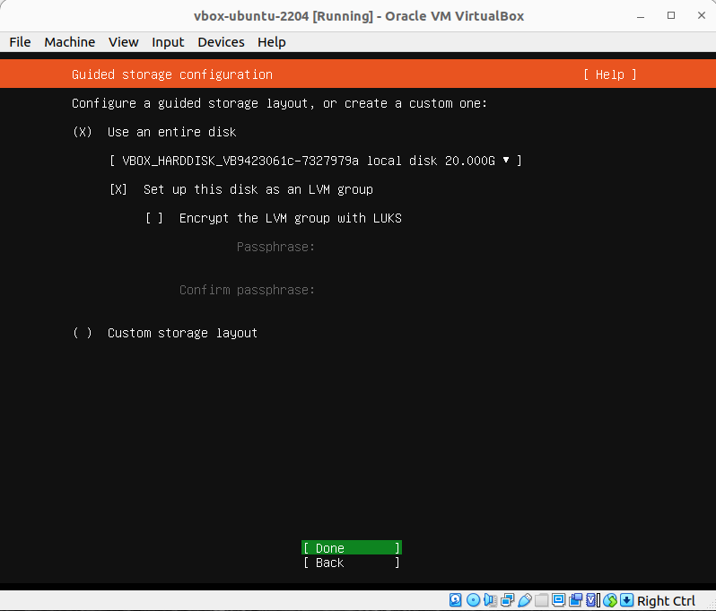
    
22. **Continue**: to confirm the partition is correct.
    
    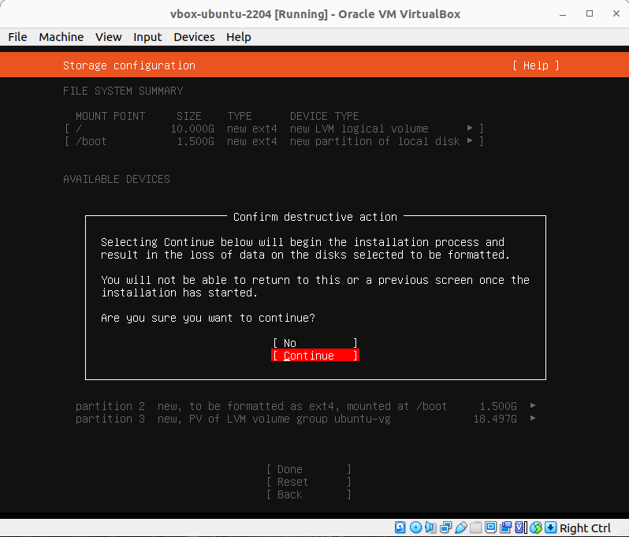
    
23. Set the system administrator name, server’s name, username and password.
    
    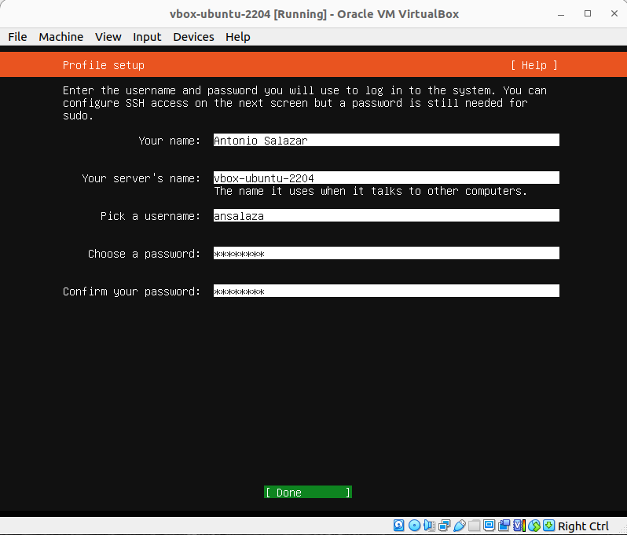
    
24. Done: leave Ubuntu’s token defaults.
    
    
    
25. **Install OpenSSH Server**: check this option and select Done.
    
    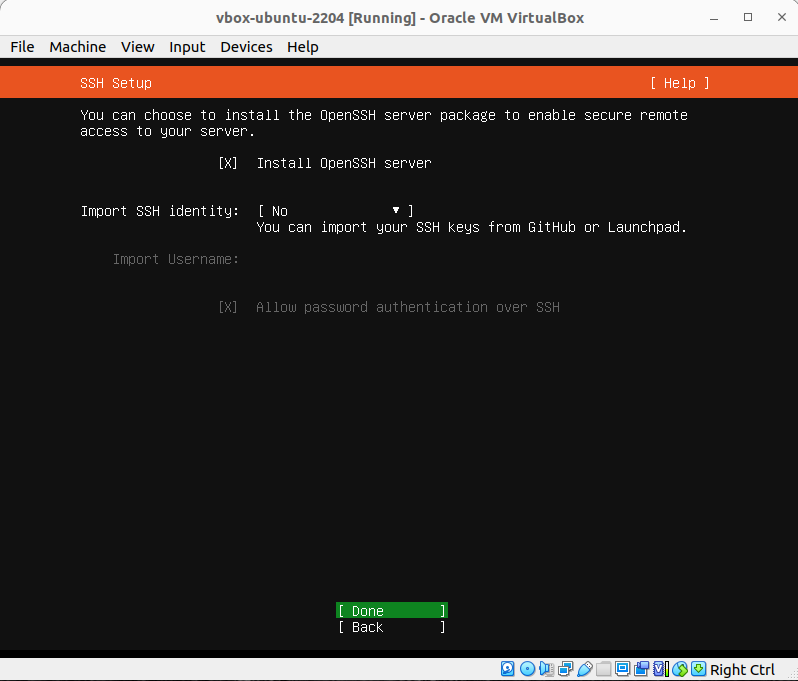
    
26. **Done**: leave the packages installation for later.
    
    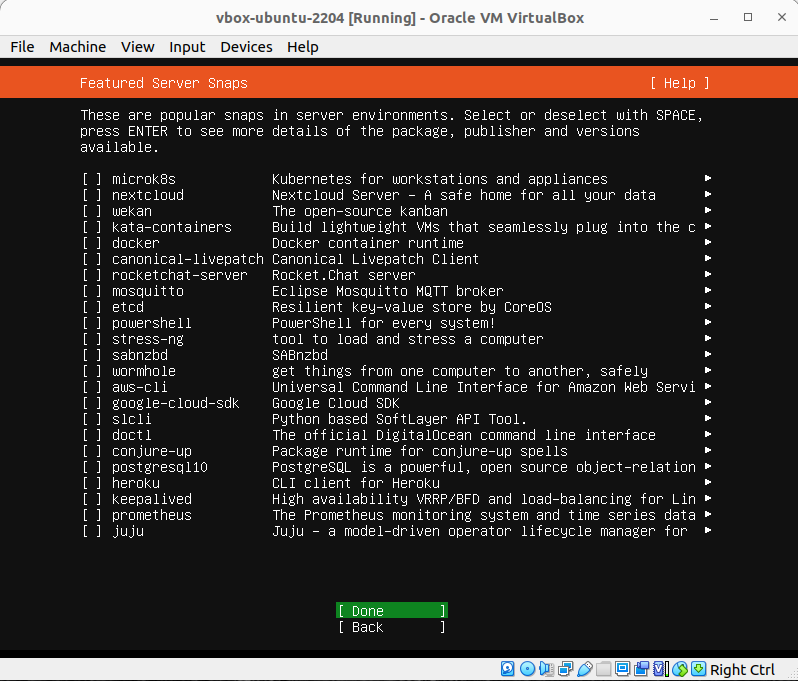
    
27. The installation process starts, so wait until it gets completed.
    
    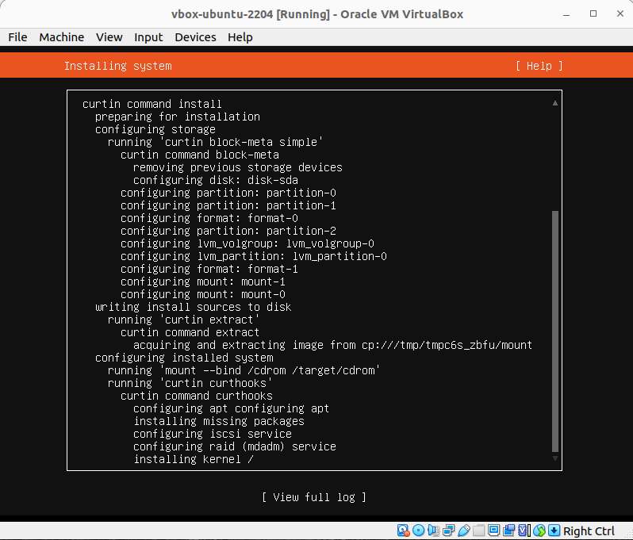
    
28. You may check the logs (View full log) for details about the installation process.
    
    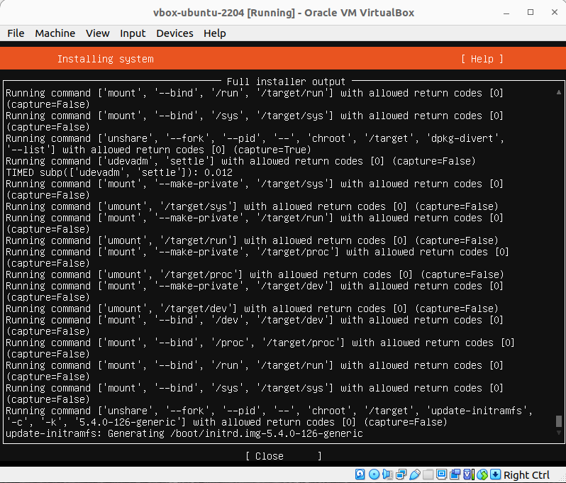
    
29. **Close**: when completed.
    
    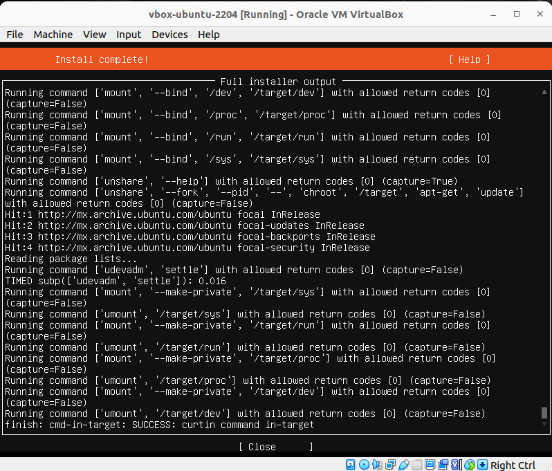
    
30. **Reboot now**.
    
    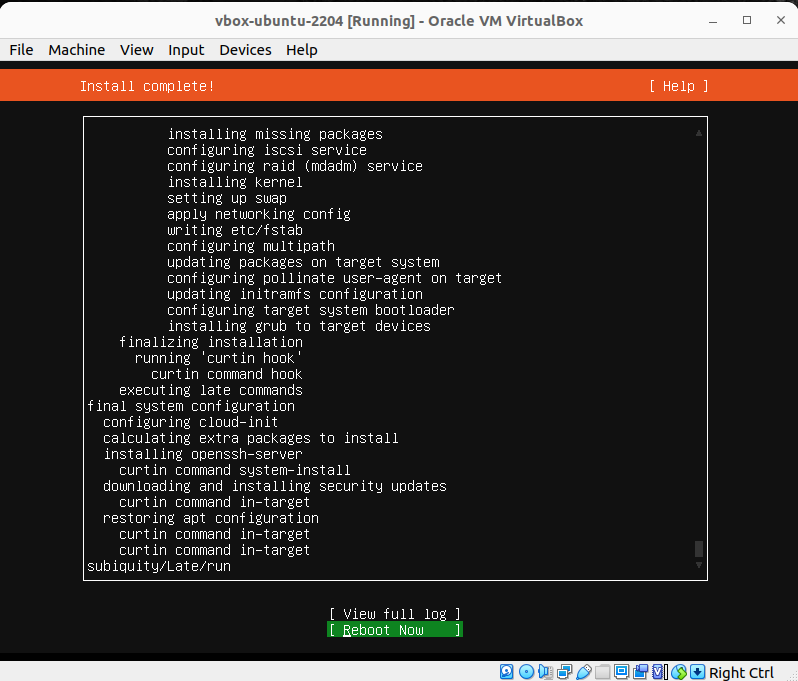
    
31. Login in with your administrator’s account to verify everything is working fine.
    
    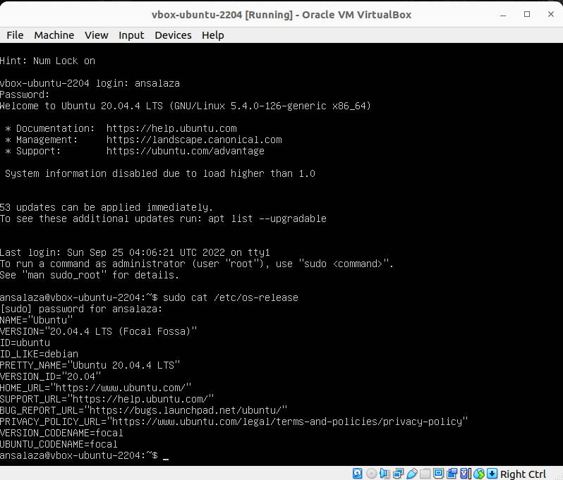
    
32. Upgrade and install all of the packages you need to work on your new ubuntu server.

 

# :books: References
- [:copyright: Canonical ubuntu Server - Basic installation](https://ubuntu.com/server/docs/installation)