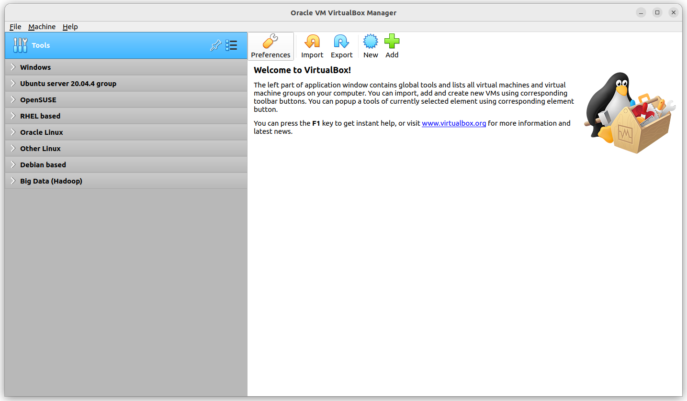
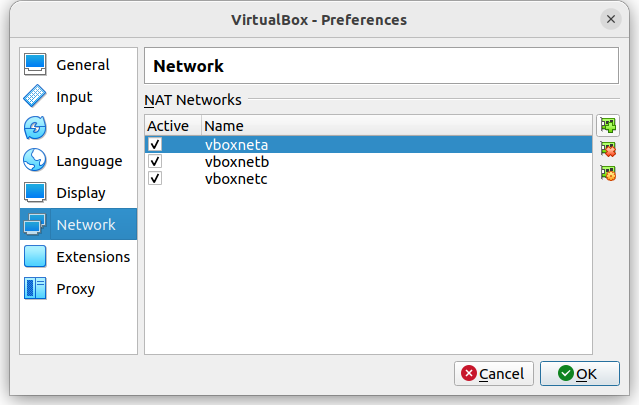
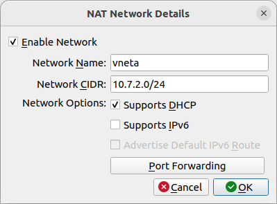
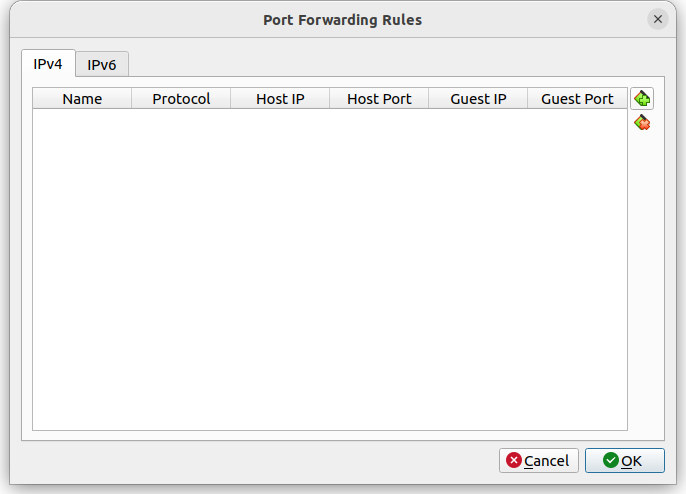
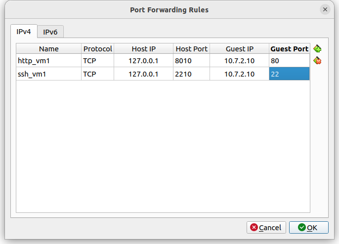
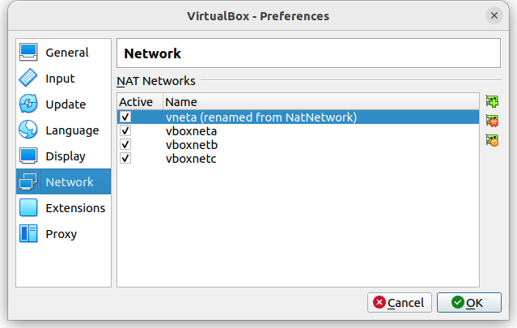
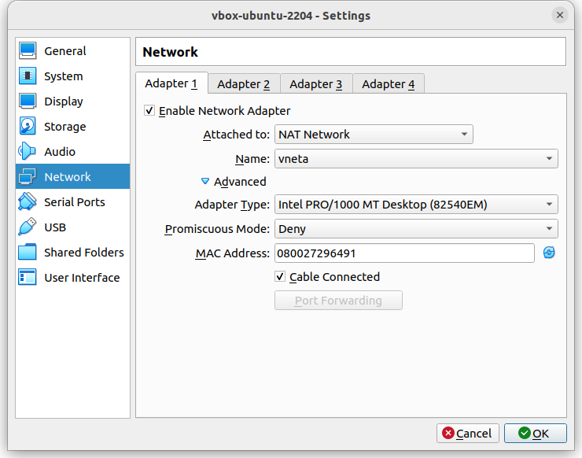
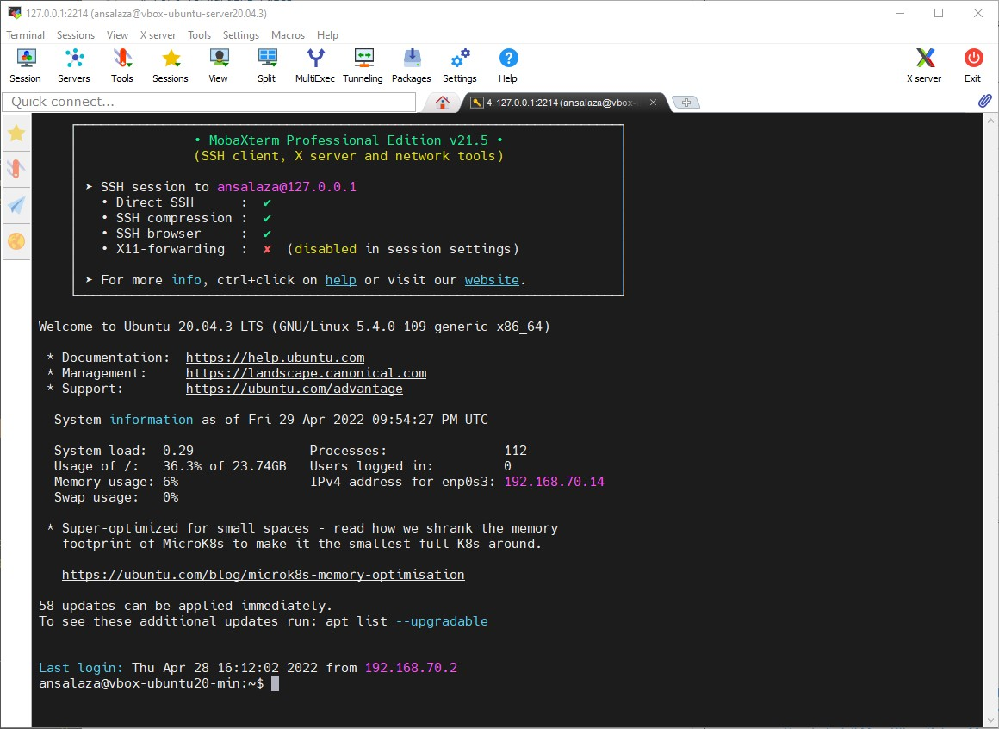
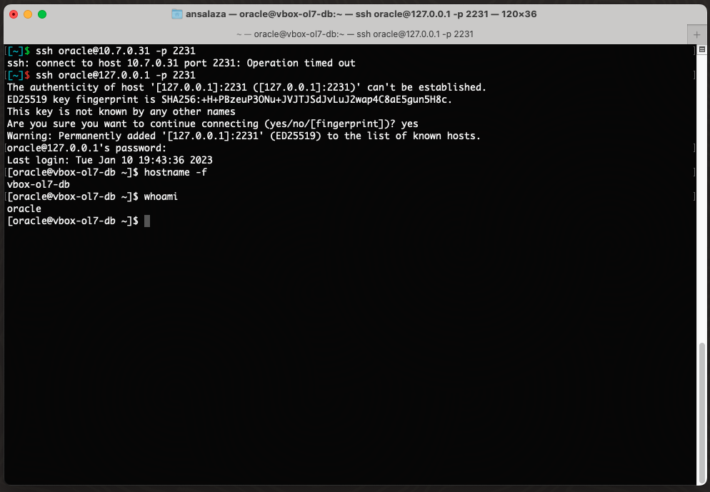

# :book: 3. Configure a virtual network with Oracle VM VirtualBox Manager

By [Antonio Salazar](mailto:antonio.salazar@ymail.com) - January 2023

# Description
With the [Oracle VM VirtualBox Manager](https://www.virtualbox.org), it is possible to connect different virtual machines in the same virtual network.

The **Network Address Translation (NAT) Network** allows the connection between the host computer and the virtual machine.

It is also feasible to select which port to use when connecting to a virtual machine by the port forwarding rules.

# Work summary
- [Set up a new Virtual NAT Network](#set-up-a-new-virtual-nat-network).
- [Define the port forwarding rules](#define-the-port-forwarding-rules).
- [Configure the virtual machine to be part of the Virtual NAT Network](#configure-the-virtual-machine-to-be-part-of-the-virtual-nat-network).
- [Set up the VM with a static IP address](#set-up-the-vm-with-a-static-ip-address). 
- [Connect to the virtual machine from the host](#connect-to-the-virtual-machine-from-the-host).

# Requisites
- Install [Oracle VM VirtualBox Manager](https://www.virtualbox.org/manual/UserManual.html#intro-installing) on your laptop, personal computer, or workstation.
- Set up a new Virtual Machine
  - [Create a new CentOS 7 Virtual Machine in VirtualBox](../vm/centos7/README)
  - [Create a new Ubuntu 22.04 Virtual Machine in VirtualBox](../vm/ubuntu2204/README)

# Steps
## Set up a new Virtual NAT Network
---
1. Open the Oracle VM VirtualBox Manager and click on **Tools > Preferences**

    ||
    |:--:|
    |Fig. 1 - VBox preferences|

- On the left pane select the **Network** menu.
- On the right side click on **Adds new NAT Network** icon.

    ||
    |:--:|
    |Fig. 2 - VBox Add NAT Network|

2. The **NatNetwork** is created by default. _(keep it selected)_
3. On the right side click on the **Edits selected NAT Network** icon.

    ||
    |:--:|
    |Fig. 3 - VBox Add NAT Network|

4. In the **NAT Network Details** screen do the action items below:
  - **Check** the **Enable Network**.
  - Set a **Network name**.
  - Configure the **Network CIDR** block.
  - **Check** the **Supports DHCP** Network Options. 
  - Click on the **Port Forwarding** button.

    ||
    |:--:|
    |Fig. 4 - VBox NAT Network Details|

## Define the port forwarding rules
---

5. On the Port Forwarding Rules screen click on the **Adds new port forwarding rule** icon.

    ||
    |:--:|
    |Fig. 5 - VBox Add new port forwarding rule|

6. For each VM service, associate the local host IP and port numbers, wit the Guest IP and port number accrdongly.

    ||
    |:--:|
    |Fig. 6 - VBox Add NAT Network|

7. Click the **OK** button to save the changes.

    ||
    |:--:|
    |Fig. 7 - VBox Add NAT Network|

<br/>

## Configure the virtual machine to be part of the Virtual NAT Network
---

1. Ensure the virtual machine is powered off.
2. Select the virtual machine and click on the **Properties** button.

    ||
    |:--:|
    |Fig. 8 - VBox VM Properties|

3. On the VM-Setting screen, select **Network** menu.
4. In the **Network** screen, pick the following values:
    - **Enable Network Adapter**: Checked
    - **Attached to**: NAT network
    - **Name**: \<your network name\> (_in this example: **vneta**_)
    - **Advanced**: Expanded
    - **Cable Connected**: Checked

    ||
    |:--:|
    |Fig. 9 - VBox VM Sessings|

5.  Click on the **OK** button.
6.  Click on the **Start** button to run the virtual machine.

## Set up the VM with a static IP address
---

1. Login to the **virtual machine** with the **admin** user credentials.
2. Switch to root `sudo su - # [ENTER]`
3. Set up your variables with the network values.

    ```bash
    NIC=`ip -o -4 a | grep -v 127.0.0.1 | awk '{print $2}'`
    IP=10.7.2.10
    CIDR="${IP}/24"
    PRIMARY=8.8.8.8
    SECONDARY=8.8.4.4
    GATEWAY=10.7.2.1
    UUID=`uuidgen $NIC`
    ```
  
    Where the values mean:

    |Variable | Description|
    |--|--|
    |NIC| VM network interface card|
    |IP| new static IP address|
    |CIDR| CIDR block. (in this example **Class C** type)|
    |PRIMARY| primary DNS IP Address by Google (free) |
    |SECONDARY| secondary DNS IP Address by Google (free) |
    |GATEWAY| virtual network gateway IP address|
    |UUID| Universal Unique Identifier for the network interface card|


4. Backup the current netplan configuration file `/etc/netplan/00-installer-config.yaml`.

    ```bash
    cp -p /etc/netplan/00-installer-config.yaml /etc/netplan/00-installer-config.yaml.bak
    ```

5. Create the new netplan configuration file `/etc/netplan/00-installer-config.yaml` with the new values.

    ```bash
    tee /etc/netplan/00-installer-config.yaml<<EOF
    network:
      renderer: networkd
      ethernets:
        ${NIC}:
          addresses:
            - $CIDR
          nameservers:
            addresses: [$PRIMARY, $SECONDARY]
          routes:
            - to: default
              via: $GATEWAY
      version: 2
    EOF 
    ```

6. Apply the changes.

    ```bash
    netplan apply
    ```

7. Verify the new IP address settings

    ```bash
    # Show NIC settings
    ip a s $NIC

    # Show route settings
    ip r

    # Show all IP addresses
    ip -o -4 a
    ```

<br/>

## Connect to the virtual machine from the host
---

1. Open a new terminal session on the host computer.
2. Connect your host computer to the virtual machine by SSH session.
   
   - Format: `ssh <username>@<localhost/127.0.0.1> -p <port number>`
   - i.e. `ssh ansalaza@127.0.0.1 -p 2210`

    _The first time you will be prompted to add a new fingerpring to the ~/.ssh/known_hosts file. So tpye `yes` and hit ENTER._

3. Verify you are logged in to the VM: `hostname -f`

<br/>


# Host computer to VM connection examples

The following examples are about connecting to a virtual machine from the local computer using a terminal or a web browser.

## Windows

Figure 10 shows how to connect to the virtual machine with [MobaXTerm](https://mobaxterm.mobatek.net/) software on Windows.

||
|:--:|
|Fig. 10 - Windows SSH connection with [MobaXTerm](https://mobaxterm.mobatek.net/) software.|


The example below is about connecting to The Jenkins console, which lives inside the VM, from the Windows Browser.

||
|:--:|
|Fig. 11 - Windows Web browser accessing the VM Jenkins application |


## Linux Gnome terminal


||
|:--:|
|Fig. 12 - Linux SSH connection to VM|

## macOS Terminal

||
|:--:|
|Fig. 13 - macOS SSH to VM|


# :books: References
- Oracle® VM VirtualBox® User Manual
  - [Chapter 6. Virtual Networking](https://www.virtualbox.org/manual/UserManual.html#networkingdetails)
  - [6.4. Network Address Translation Service](https://www.virtualbox.org/manual/UserManual.html#network_nat)

