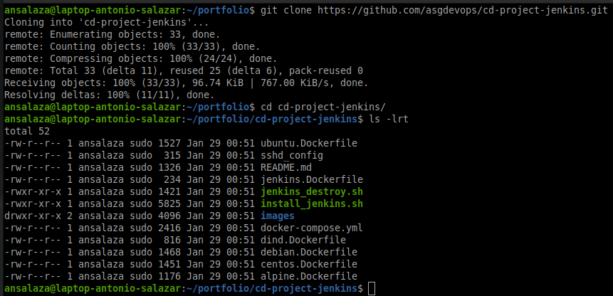
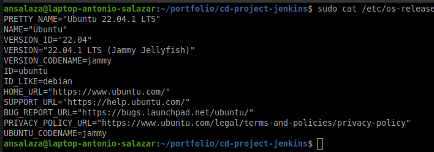
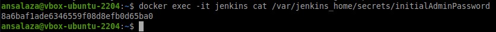
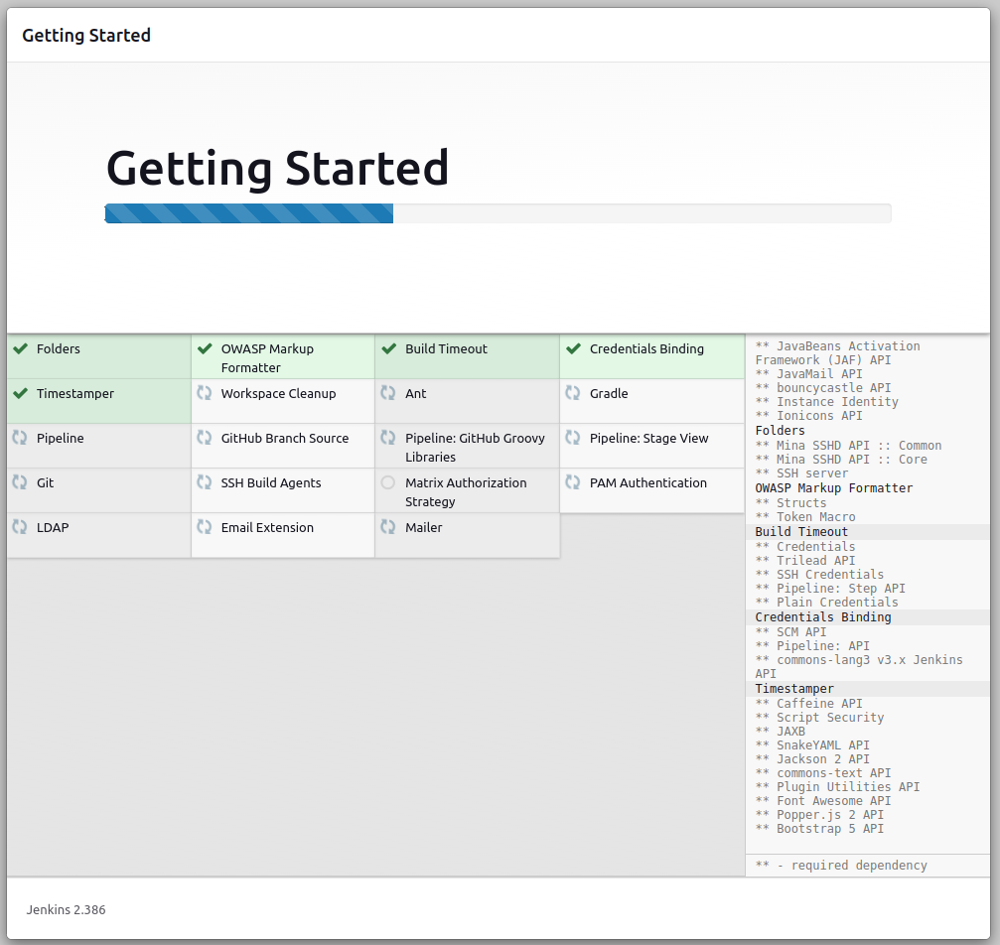
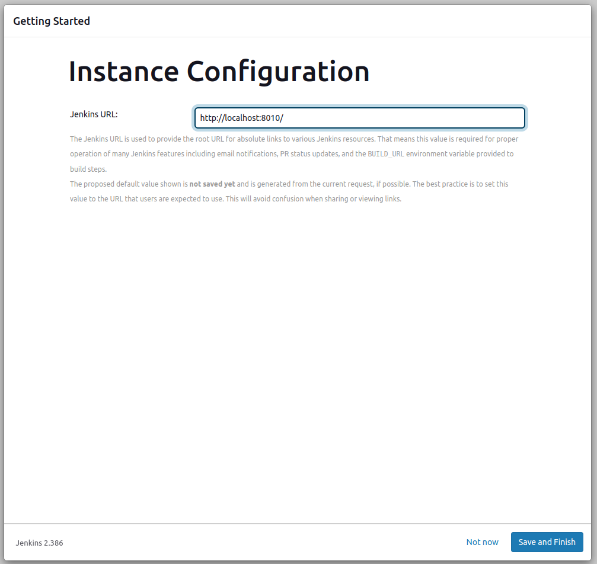

# Setup jenkins

# Prepare Jenkins storage

1. Execute the steps found at [Adding storage ](adding_storage/README.md)
2. Create jenkins persistent directories

- Jenkins app data
```bash
sudo mkdir -p /data/jenkins_home && sudo chown -R $USER:docker /data/jenkins_home ;
```

- Jenkins certificates
```bash
sudo mkdir -p /data/jenkins_cert/ca ;
sudo mkdir -p /data/jenkins_cert/client ;
sudo chown -R $USER:docker /data/jenkins_cert ;
```

# Jenkins Installation

1. Ensure the Ubuntu VM is running and start a new SSH session.

    ```bash
    ssh ansalaza@localhost -p 2210
    ```

    ||
    |:--:|
    |Figure 1 - SSH log into VM |

2. Create the jenkins application volume on the VM host

    ```bash
    sudo mkdir -p /data/jenkins_home
    ```

    ||
    |:--:|
    |Figure 2 - VM host jenkins volume|

3. Run a new jenkins Docker container on the VM host

- Single line

  ```bash
  docker run -d --name jenkins -p 8080:8080 -v /data/jenkins_home:/var/jenkins_home jenkins/jenkins
  ```

- Descriptive command 

  ```bash
  # descriptive way
  docker run --detach \
    --name jenkins \
    --publish 8080:8080 \
    --volume /data/jenkins_home:/var/jenkins/home \
    jenkins/jenkins
  ```

    ||
    |:--:|
    |Figure 3 - Create Jenkins Docker container |

4. Verify the container is running

    ```bash
    docker ps
    ```

    ||
    |:--:|
    |Figure 4 - Jenkins Docker container is running|

5. Get the **initial Admin Password**

- Retrieve it from file

  ```bash
  docker exec -it jenkins cat /var/jenkins_home/secrets/initialAdminPassword
  ```

  ||
  |:--:|
  |Figure 5 - Jenkins initial Admin Password from file |

- Gather it from the container log

  ```bash
  docker logs jenkins
  ```

  ||
  |:--:|
  |Figure 6 - Jenkins initial Admin Password from log|

6. On **Oracle VM virtualBox Manager**, use the virtual network port forwarding rules to map the host port 8010 to the VM port 8080.

   - Open **Oracle VM VirtualBox Manager** and click on **Tools** > **Preferences**
   - On the **VirtualBox - Preferences** screen, select **Network** from the left pane.

    ||
    |:--:|
    |Figure 6a - VirtualBox - Preferences|

   - Select your virtual network and click on the **Edits Selected NAT Network** icon on the right side of the screen.

   - On the **NAT Network Details** screen click on **Port Forwading**

    ||
    |:--:|
    |Figure 6b - NAT Network Details|

   - Add a new port forwarding rule with as shown in the table below:

     |Name|Protocol|Host IP|Host Port|Guest IP|Guest Port|
     |--|--|--|--|--|--|
     |http_vm1|TCP|127.0.0.1|8010|10.7.2.10|8080|

    ||
    |:--:|
    |Figure 6c - Port Forwarding Rules|


7. Login to Jenkins application in the web browser.
   - Open a new Web Browser and go to `http://localhost:8080`
   - Type the admin password taken from the jenkins Docker container

       ||
       |:--:|
       |Figure 7 - Unlock Jenkins|

   - Click on the **Install suggested plugins** button

       ||
       |:--:|
       |Figure 7a - Customize Jenkins|

   - Monitor the progress of the plug ins installation

       ||
       |:--:|
       |Figure 7b - Getting Started|

   - Input the **Admin User** credentials

       ||
       |:--:|
       |Figure 7c - Create First Admin User|

   - Set up the Jenkins Application URL and port number

       ||
       |:--:|
       |Figure 7d - Instance Configuration|

   - After getting the confirmation page, click on **Start using Jenkins**

       ||
       |:--:|
       |Figure 7e - Jenkins is ready!|

   - Now the Jenkins Dashboard screen is open

       ||
       |:--:|
       |Figure 7f - Jenkins Dashboard|


# Configuring Jenkins

## Set up the Jenkins Agent

1. On the VM host, create the working directory

```bash
sudo mkdir -p /data/dockerfile
```

2. Go to the working directory and create the Dockerfile
```docker
cd /data/dockerfile/

tee Dockerfile<<EOF
FROM jenkins/agent
USER root
RUN apt-get update && \
    apt-get install -y python
USER jenkins
EOF
```

3. Build the Jenkins Agent Docker Image

```bash
docker build -t ansalaza/jenkins-agent-python .
```

```
docker start jenkins
```
## Set up the jenkins master

1. Executors

```groovy
sudo tee executors.groovy<<EOF
import jenkins.model.*
Jenkins.instance.setNumExecutors(5)
EOF
```

2. Dockerfile

```docker
sudo tee Dockerfile<<EOF
FROM jenkins/jenkins:lts-jdk11
COPY executors.groovy /usr/share/jenkins/ref/init.groovy.d/executors.groovy
RUN jenkins-plugin-cli --plugins docker-plugin github-branch-source:1.8
EOF
```

Pipeline
```groovy
pipeline {
  agent any
  stages {
    stage ("Hello") {
      steps {
        echo 'Hello World!'
      }
    }
  }
}
```


## On macOS and Linux
1. Open up a terminal window.
2. Create a bridge network in Docker using the following docker network create command:

```bash
docker network create jenkins
```

3. Create the docker in docker volumes;

```bash
docker volume create jenkins-docker-certs-ca
docker volume create jenkins-docker-certs-client
docker volume create jenkins-data
```

4. In order to execute Docker commands inside Jenkins nodes, download and run the docker:dind Docker image using the following docker run command:

```docker
docker run \
  --name jenkins-docker \
  --detach \
  --privileged \
  --network jenkins \
  --network-alias docker \
  --env DOCKER_TLS_CERTDIR=/certs \
  --volume jenkins-docker-certs-ca:/certs/ca \
  --volume jenkins-docker-certs-client:/certs/client \
  --publish 2376:2376 \
  docker:dind \
  --storage-driver overlay2
```


```docker
docker run \
  --name jenkins-docker \
  --detach \
  --privileged \
  --network jenkins_net \
  --network-alias docker \
  --env DOCKER_TLS_CERTDIR=/certs \
  --volume /data/jenkins_cert/ca:/certs/ca \
  --volume /data/jenkins_cert/client:/certs/client \
  --publish 2376:2376 \
  docker:dind \
  --storage-driver overlay2
```


- notes

It is important to keep the network-alias = docker in the jenkins-docker container, otherwise, errors like this happen:
```
error during connect: Get "https://docker:2376/v1.24/containers/<container name>": dial tcp: lookup docker: Temporary failure in name resolution
```

- to test the jenkins-container connection
```
curl http://localhost:2375/version
```

```
docker run \
  --name some-docker \
  --detach \
  --privileged \
	--network some-network \
  --network-alias docker \
	-e DOCKER_TLS_CERTDIR=/certs \
	-v some-docker-certs-ca:/certs/ca \
	-v some-docker-certs-client:/certs/client \
	docker:dind
```

1. Customise official Jenkins Docker image, by executing below two steps:
a. Create Dockerfile with the following content:

```docker
tee Dockerfile<<EOF
FROM jenkins/jenkins:2.387-jdk11
USER root
RUN apt-get update && apt-get install -y lsb-release
RUN curl -fsSLo /usr/share/keyrings/docker-archive-keyring.asc \
    https://download.docker.com/linux/ubuntu/gpg
RUN echo "deb [arch=amd64 signed-by=/usr/share/keyrings/docker-archive-keyring.asc] \
    https://download.docker.com/linux/ubuntu focal stable" > /etc/apt/sources.list.d/docker.list
RUN apt-get update && apt-get install -y docker-ce-cli
USER jenkins
RUN jenkins-plugin-cli --plugins "blueocean docker-workflow"
EOF
```

b. Build a new docker image from this Dockerfile and assign the image a meaningful name, e.g. "jenkins-blueocean:2.375.2-jdk11":

```
docker build -t jenkins-blueocean:2.387-jdk11 .
```

> [Docker GPG Index For Linux](https://download.docker.com/linux/)

6. Run your own myjenkins-blueocean:2.375.2-1 image as a container in Docker using the following docker run command:

```bash
docker run \
  --name jenkins-blueocean \
  --restart=on-failure \
  --detach \
  --network jenkins \
  --env DOCKER_HOST=tcp://docker:2376 \
  --env DOCKER_CERT_PATH=/certs/client \
  --env DOCKER_TLS_VERIFY=1 \
  --publish 8080:8080 \
  --publish 50000:50000 \
  --volume jenkins-data:/var/jenkins_home \
  --volume jenkins-docker-certs-client:/certs/client:ro \
  jenkins-blueocean:2.387-jdk11
```
7. Edit `/lib/systemd/system/docker.service`

```
sudo vi /lib/systemd/system/docker.service
```

-Comment the line starting with ExecStart
- create a new line with the following parameters
``` 
ExecStart=/usr/bin/dockerd -H tcp://0.0.0.0:2375 -H unix:///var/run/docker.sock
```
- Reload docker daemon
```
sudo systemctl daemon-reload
```

- Restart docker service
```
sudo service docker restart
```


docker compose
```
docker compose -p jenkins up -d
```

- Create agent SSH keys
```
ssh-keygen -b 4096 -f ./jenkins_key -N '' -q -t rsa ;
```


```
docker build . --build-arg username=ubuntu -f ubuntu-agent.Dockerfile -t ubuntu/agent:22.04
docker run --detach --name ubuntu-agent --network jenkins_net --rm ubuntu/agent:22.04
```


```
/ # ps -ef | grep docker
    1 root      0:01 docker-init -- dockerd --host=unix:///var/run/docker.sock --host=tcp://0.0.0.0:2376 --tlsverify --tlscacert /certs/server/ca.pem --tlscert /certs/server/cert.pem --tlskey /certs/server/key.pem
   52 root      0:10 dockerd --host=unix:///var/run/docker.sock --host=tcp://0.0.0.0:2376 --tlsverify --tlscacert /certs/server/ca.pem --tlscert /certs/server/cert.pem --tlskey /certs/server/key.pem
   61 root      0:05 containerd --config /var/run/docker/containerd/containerd.toml --log-level info
 1031 root      0:00 grep docker
```