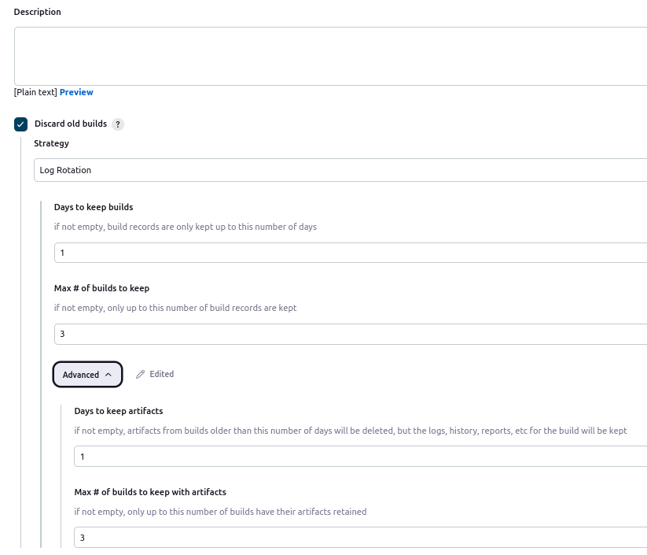
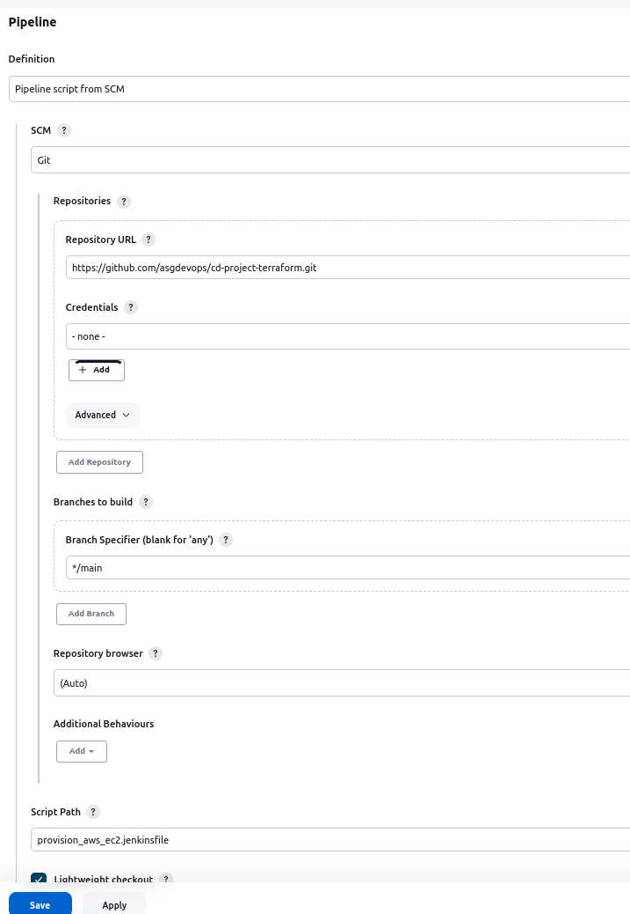
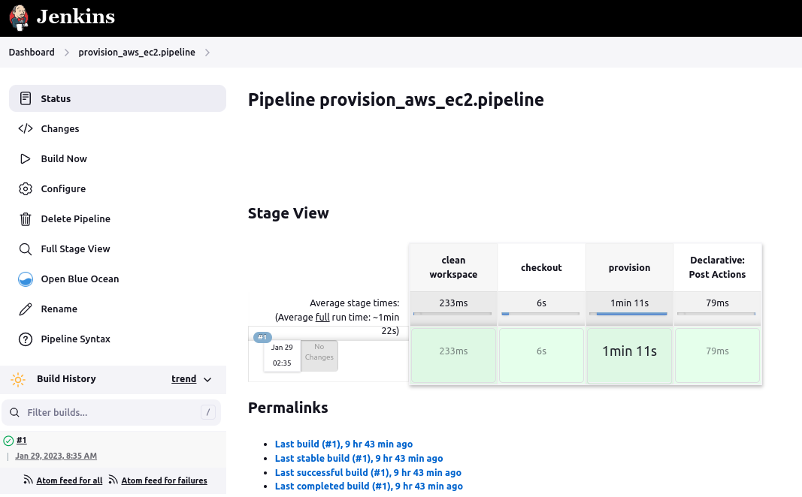

# :book: 6. Provision an EC2 Instance in AWS Platform

## Goal 
- Provision an AWS EC2 instance from a Jenkins pipeline.
- The pipeline has to pull the script from a GitHub SCM repository.
- It also launches the Terraform scripts in charge of provisioning the AWS EC2 instance.

## Requiremens
- Signup with a Free Tier accoutn in AWS.
- Set up the Terraform scripts to create the objects below:
  - Virtual Private Cloud (VPC).
  - Public Subnet.
  - Public Route table.
  - Internet Gateway.
  - Create the security groups for HTTP 8080 and SSH 22 ports.
  - Associate the Network objects accordingly.
  - Use a current key-pair to connect to EC2 Instance.
  - Create and Launch an EC2 instance with Ubuntu 22.04 system.

# Architecture

The architecture followed in this document consists of a single instance living in its subnet and VPC accoringly.

The EC2 has the HTTP port 8080 and the SSH port 22 open by the security group. 

The route table is associated with the public subnet and the Internet Gateway, so that the EC2 instance could be accessed from any part.

The login access is achieved by the ssh key-pair.

  ||
  |:--:|
  ||
  |Fig 1. AWS EC2 instance architecture|

# Provisioning 

Jenkins flexibility allows the integration of GitHub with Terraform in the Pipeline code.

Having a solid coding template turns easy and quick to provision an EC2 instance in the AWS Cloud platform.

## Scripts usage

|No.|Script name|Purpose or function|Links to|
|--:|--|--|--|
|1|[variable.tf](scripts/variable.tf)|Variables file for most of the Terraform scripts ||
|2|[provider.tf](scripts/provider.tf)|Defines the AWS provider, vesrioning and project owner tags|
|3|[vpc.tf](scripts/vpc.tf)|Provisions the main networking objects needed to allocate the EC2 instance such as: Vitual Private Cloud (VPC), Internet Gateway (IGW), Public Route table (RTB), Public Subnet and Security groups. It also makes the neccesary associattions between those, t0o keep the information flowing, but secure. |
|4|[security-group.tf](scripts/security-group.tf)|Provisions the security group for allow access to the EC2 instance from the inbound HTTP port 8080 and SSH port 22.|
|5|[instance.tf](scripts/instance.tf)|Provisions the EC2 instance according to the network configurations above.|
|6|[provision_aws_ec2.jenkinsfile](scripts/provision_aws_ec2.jenkinsfile)|This is a declarative pipeline to integrate Terraform scripts to provision the EC2 instance. It uses CloudBees AWS plugin, to store the AWS Account Credentials. It also calls the 'alpine_controller' agent node, since it contains the Terraform packages to run the Terraform scripts. |

Notice the Jenkins Pipeline job, lives in the [asgdevops/cd-project-terraform](https://github.com/asgdevops/cd-project-terraform) GitHub repository. 

So when running a Build process, it gets polled crom GitHub SCM.

The process below will be replicated on the AWS EC2 instance.
As a result, follow the steps below to complete the Jenkins installation.

# Running the EC2 povisioning pipeline

1. Go to Jenkins **Dashboard**
2. Click on **+ New Item**
3. Type `provision_aws_ec2.pipeline` 
4. Select **Piepline** and click **OK**
5. Fill in the follwing fields
    - Check **Discard Old builds** to save disk space.
    - Choose the number of days or runs you would like to keep. 

        ||
        |:--:|
        |Figure 1 - Discard Old Builds|

    - In the Pipeline section select the following:
      - Definition: **Pipeline Script from SCM**
        - SCM: **Git**
        - Repository URL: [asgdevops/cd-project-terraform](https://github.com/asgdevops/cd-project-terraform.git)
        - Branch Specifier (blank for 'any'): ***/main**
        - Script Path: [provision_aws_ec2.jenkinsfile](https://github.com/asgdevops/cd-project-terraform/blob/main/provision_aws_ec2.jenkinsfile)
        - **Save**.

        ||
        |:--:|
        |Figure 2- Pipeline Script from SCM|

6. Build and monitor the job progress.

    ||
    |:--:|
    |Figure 3 - Pipeline build|

 

# :movie_camera: Set up jenkins recording
- [Provisioning AWS EC2 Instance with Jenkins](https://youtu.be/HOLtCd-BaNo)

# :page_facing_up: Log file examples
- [provision_aws_ec2.pipeline.log](logs/provision_aws_ec2.pipeline.log)

# :books: References
- [Define Infrastructure with Terraform Resources](https://developer.hashicorp.com/terraform/tutorials/configuration-language/resource?in=terraform%2Fconfiguration-language)

