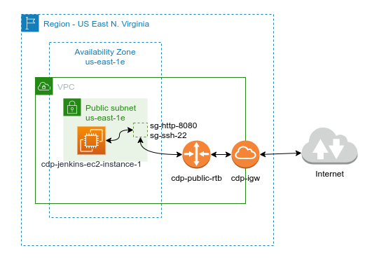

# :book: 6. Provision an EC2 Instance in AWS Platform

## Goal 
- Provision an AWS EC2 instance from a Jenkins pipeline.
- The pipeline has to pull the script from a GitHub SCM repository.
- It also launches the Terraform scripts in charge of provisioning the AWS EC2 instance.

## Requiremens
- Signup with a Free Tier accoutn in AWS.
- Set up the Terraform scripts to create the objects below:
  - Virtual Private Cloud (VPC).
  - Public Subnet.
  - Public Route table.
  - Internet Gateway.
  - Create the security groups for HTTP 8080 and SSH 22 ports.
  - Associate the Network objects accordingly.
  - Use a current key-pair to connect to EC2 Instance.
  - Create and Launch an EC2 instance with Ubuntu 22.04 system.


# Architecture

The architecture followed in this document consists of a single instance living in its subnet and VPC accoringly.

The EC2 has the HTTP port 8080 and the SSH port 22 open by the security group. 

The route table is associated with the public subnet and the Internet Gateway, so that the EC2 instance could be accessed from any part.

The login access is achieved by the ssh key-pair.

  ||
  |:--:|
  ||
  |Fig 1. AWS EC2 instance architecture|

# Provisioning 

Jenkins flexibility allows the integration of GitHub with Terraform in the Pipeline code.

Having a solid coding template turns easy and quick to provision an EC2 instance in the AWS Cloud platform.

## Scripts usage

|No.|Script name|Purpose or function|Links to|
|--:|--|--|--|
|1|[install_jenkins.sh](jenkins/install_jenkins.sh)|Jenkins installer for Ubuntu 22.04 systems. <br/> 1. Creates the `.env` environments variable file. <br/> 2. Installs Docker Engine. <br/> 3. Configures the persistent volumes directories. <br/> 4. Creates the SSH key pair (ed25519) to keep the jenkins controller and nodes working together. <br/> 5. Launches the `docker-compose.yml` file to build and run the Jenkins containers.|--> docker-compose.yml file|
|2|[docker-compose.yml](jenkins/docker-compose.yml)|1. Builds the images of the Jenkins controller and agent nodes. <br/> 2. Creates the containers from the docker images. <br/> 3. Creates the Docker network. <br/> 4. Binds the docker volumes for persitent data.|--> jenkins.Dockerfile <br/> --> centos.Dockerfile <br/> --> debian.Dockerfile <br/> --> ubuntu.Dockerfile|
|3|[alpine.Dockerfile](jenkins/alpine.Dockerfile)|Builds the alpine:3.17 controller node. <br/> 1. Sets up the jenkins user with root privileges. <br/> 2. Installs and configures SSHD. <br/> 3. Installs git, openJDK 11, Ansible and Terraform. ||
|4|[centos.Dockerfile](jenkins/centos.Dockerfile)|Builds the centos:7 agent node. <br/> 1. Sets up the jenkins user with root privileges. <br/> 2. Installs and configures SSHD. <br/> 3. Installs git and openJDK 11.||
|5|[debian.Dockerfile](jenkins/debian.Dockerfile)|Builds the debian:11 agent node. <br/> 1. Sets up the jenkins user with root privileges. <br/> 2. Installs and configures SSHD. <br/> 3. Installs git and openJDK 11.||
|6|[ubuntu.Dockerfile](jenkins/ubuntu.Dockerfile)|Builds the ubuntu:22.04 agent node. <br/> 1. Sets up the jenkins user with root privileges. <br/> 2. Installs and configures SSHD. <br/> 3. Installs git and openJDK 11.||

The process below will be replicated on the AWS EC2 instance.
As a result, follow the steps below to complete the Jenkins installation.

# Steps

1. Ensure the Ubuntu VM is running and start a new SSH session.

    ```bash
    ssh ansalaza@localhost -p 2210
    ```

    ||
    |:--:|
    |Figure 1 - SSH log into VM |


# :books: References
- [Installing Jenkins - Docker](https://www.jenkins.io/doc/book/installing/docker/)