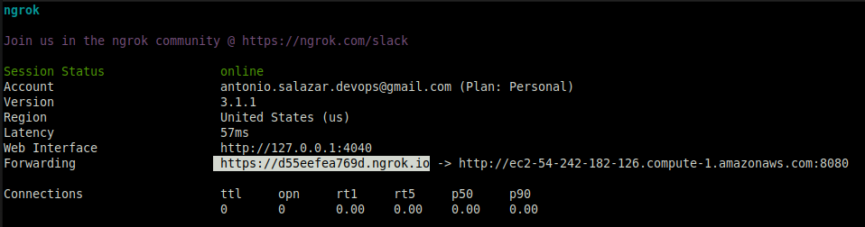
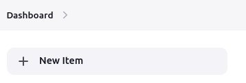

# :book: 8. Set up a WebHook trigger in Jenkins and Github 

## Goals
- Create a pipeline and save it in a GitHub repository.
- Set up a service like ngrok.
- Modify a sample code and push it to GitHub.
- Monitor the Jenkins instance in AWS EC2 trigers the pipeline job as soon as the GitHub push event is completed.

## Requisites
- Have a GitHub acount.
- Maintiain your GitHub repository with pipelines avialable to work with.
- Integrate GitHub SCM pipelines with Jenkins.

# GitHub WebHook Setup
## Steps
1. Get the target URL from the AWS EC2 Public DNS.

    ||
    |:--:|
    |Figure 1 -  AWS EC2 Public DNS |


2. Install and set up a service such as [nrok](https://ngrok.com/).

3. Launch the **ngrok** service with the URL taken from the AWS EC2 Public DNS and Jenkins port number.

    i.e.

    ```bash
    ngrok http http://ec2-54-242-182-126.compute-1.amazonaws.com:8080
    ```

    ||
    |:--:|
    |Figure 2 - ngrok service |


4. Open your GitHub repository. In this case [asgdevops/pipelines](https://github.com/asgdevops/pipelines) repository .


5. Click on the **Settings** tab.

    ||
    |:--:|
    |Figure 3 - GitHub **Settings** |    


6. Then on the left pane select **Webhooks**.

    ||
    |:--:|
    |Figure 4 - GitHub **Webhooks** |    

7. Click on the **Add webhook** button.

    ||
    |:--:|
    |Figure 5 - **Add Webhook** |    

8. Input the values below:
    - Take the Forwarding address from the **ngrok** terminal output `https://d55eefea769d.ngrok.io` and add the statement `/github-webhook/` at the end. Then place it in the **Payload URL**.
      i.e.
      ```text
      https://d55eefea769d.ngrok.io/github-webhook/
      ```

      ||
      |:--:|
      |Figure 6 - ngrok service **Forwarding** output|    

    - In **Content Type** select `application/json`.
    - Input in **secret** the token given by the **ngrok** service.
    - Click on the **Add Webhook** button.

    ||
    |:--:|
    |Figure 7 -  Add Webhook **parameter values**|    


9.  To verify the setup is correct, go to the Recent Deliveries tab.

    ||
    |:--:|
    |Figure 8 - Webhook feedback|    

    _If a green chekmark appears near the Webhook ID, it means the configuration is good. Otherwise, look for the response message to troubleshoot the issue._

    ||
    |:--:|
    |Figure 9 - Webhook Recent Deliveries|
 
<br/>

# Jenkins Pipeline Integration
1. Opwn your AWS EC2 Jenkins Instance [http://ec2-54-242-182-126.compute-1.amazonaws.com:8080/](http://ec2-54-242-182-126.compute-1.amazonaws.com:8080/)

2. Go to the Dashboard and Click on **\+ New Item**

    ||
    |:--:|
    |Figure 10 - Jenkins **+ New Item**|

3. Type the Pipeline **Item name**, select **Pipeline** and click on **OK**

    ||
    |:--:|
    |Figure 11 - Item name|

4. To Save space, discard Old builds.

    ||
    |:--:|
    |Figure 12 - Discard Old Build|

5. Ensure to check the :ballot_box_with_check: **GitHub trigger for GITScm polling**   

    ||
    |:--:|
    |Figure 12 - Discard Old Build|

    _If this check is missed, the process simply does not work._

6. In the Pipeline section fill the information below:

    - Definition: **Pipeline Script from SCM**
    - SCM: **Git**
    - Repository URL: (your repository) in this example [asgdevops/pipelines](https://github.com/asgdevops/pipelines.git)
    - Branch Specifier (blank for 'any'): ***/main**
    - Script Path: (your pipeline script name) in this example [java_hello.jenkinsfile](https://github.com/asgdevops/pipelines/blob/main/java_hello.jenkinsfile)
    - **Save**.

    ||
    |:--:|
    |Figure 13 - Pipeline fields|

7. Clock on :arrow_forward: **Build Now**

    ||
    |:--:|
    |Figure 14 - Discard Old Build|

8. Monitor the job completes successfully.

    ||
    |:--:|
    |Figure 15 - Discard Old Build|

9. Edit your repository code, save it and push it to your GitHub repository.

      _In this example a new line is added to the `hello_world.java` program._

    ||
    |:--:|
    |Figure 16 - hello_world.java modified|


    ||
    |:--:|
    |Figure 17 - hello_world.java compiled|

    ||
    |:--:|
    |Figure 18 - hello_world.java pushed to GitHub repo|


10. Watch the Pipeline Build History Dashboard, a few seconds later after the code is pushed to GitHub, the Jenkins pipeline job is triggered.

    _In this example a new line is added to the java_hello program._

    ||
    |:--:|
    |Figure 19 - hello_world.java pushed to GitHub repo|

11. Look at the job log for more details.


    ||
    |:--:|
    |Figure 20 - hello_world.java pushed to GitHub repo|

<br/>

# :movie_camera: Webhook Trigger with Github and Jenkins
- [Set up a GitHub Webhook](https://youtu.be/VRUgmVWLQxA)

# :page_facing_up: Log file examples
- [java_hello.log](logs/java_hello.log)
- [ansible_install_apache_deb.log](logs/ansible_install_apache_deb.log)
- [ansible_install_apache_rhel.log](logs/ansible_install_apache_rhel.log)

# References
- [GitHub Repository Webhooks](https://ngrok.com/docs/integrations/github/webhooks)

## Repositories used for this test
- :link: [asgdevops/cd-project-ansible](https://github.com/asgdevops/cd-project-ansible)
- :link:[asgdevops/pipelines](https://github.com/asgdevops/pipelines)


